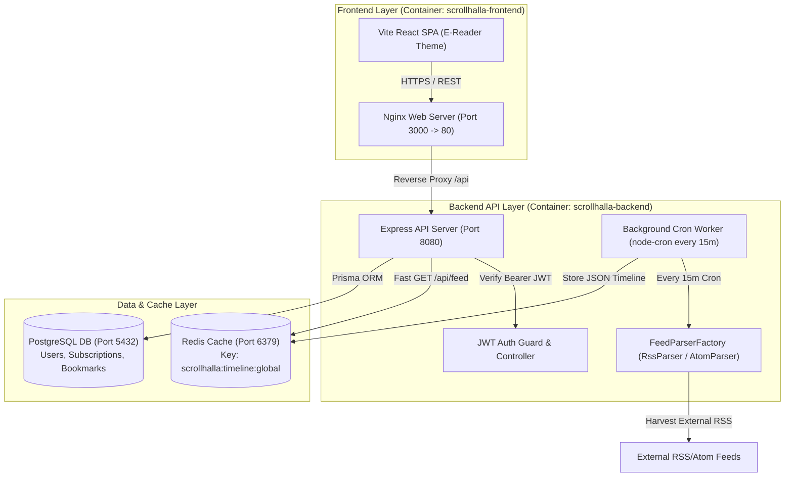

# 📐 Scrollhalla - System Architecture & Data Flow Diagram

This document contains the official Mermaid system architecture diagram for **Scrollhalla**, illustrating the data flow across the client, backend API server, background cron worker, data layer, and external RSS telemetry feeds.

---

## 📊 System Architecture Diagram (Mermaid)

---

## 🔍 Architecture Component Breakdown

### 1. Frontend Layer (`scrollhalla-frontend`)
- **Vite React SPA**: Mobile-first E-Reader UI adhering to warm paper aesthetics (`#F4F1EA`), featuring Instagram Reels-style vertical feed scrolling and Anthropic/Claude serif typography.
- **Nginx Web Server**: Multi-stage production container exposing port `3000` (mapped to internal port `80`) and proxying `/api/` HTTP requests to the backend server.

### 2. Backend API Layer (`scrollhalla-backend`)
- **Express API Server**: High-performance Node.js server exposing REST endpoints (`/api/feed`, `/api/auth`, `/api/smart-backlog`, `/api/sprint-risk`).
- **Background Cron Worker**: `node-cron` process executing every 15 minutes (`*/15 * * * *`) to harvest RSS and Atom feeds asynchronously without blocking client requests.
- **FeedParserFactory**: Object-Oriented Factory pattern instantiating `RssParser` or `AtomParser` dynamically based on XML payload signatures.
- **JWT Auth Guard**: Middleware verifying `Authorization: Bearer <token>` HTTP headers.

### 3. Data & Caching Layer (`scrollhalla-postgres` & `scrollhalla-redis`)
- **Redis Cache (`:6379`)**: In-memory caching engine storing pre-parsed timeline JSON arrays (`scrollhalla:timeline:global`) to achieve < 50ms read latency.
- **PostgreSQL Database (`:5432`)**: Persistent relational database managed via Prisma ORM storing Users, Subscriptions, Articles, and Bookmarks.
